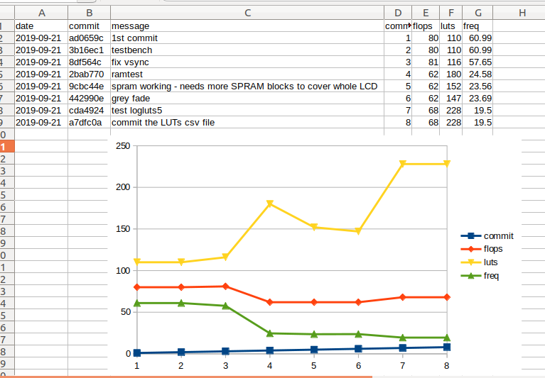

# log FPGA resource usage to CSV file

store and plot LUT, flip-flop and max frequency stats.

## setup

    pip3 install .

Editable install:

    pip3 install -e .

Install with plotting support:

    pip3 install [-e] .[plot]

If using as part of a PDM project (without plotting):

    pdm add git+https://github.com/mattvenn/logLUTs.git

If using as part of a PDM project (with plotting):

    pdm add git+https://github.com/mattvenn/logLUTs.git[plot]

## usage

add as a git hook:

1. add -l switches to log output to files for yosys and nextpnr in your Makefile
1. add a [post-commit](post-commit) hook to your git repo like this:
    1. vi post-commit # edit the hook to fit your repo
    1. cp post-commit .git/hooks/post-commit
1. now everytime you commit, the resource usage will be added to the log file

or in your makefile:

    logluts:
        $(LOG_LUTS) --add-commit --git ../

    plotluts:
        $(LOG_LUTS) --plot --git ../

## plotting

an interactive plot is available with the --plot argument. 
Move the mouse to see the commit hash and message

